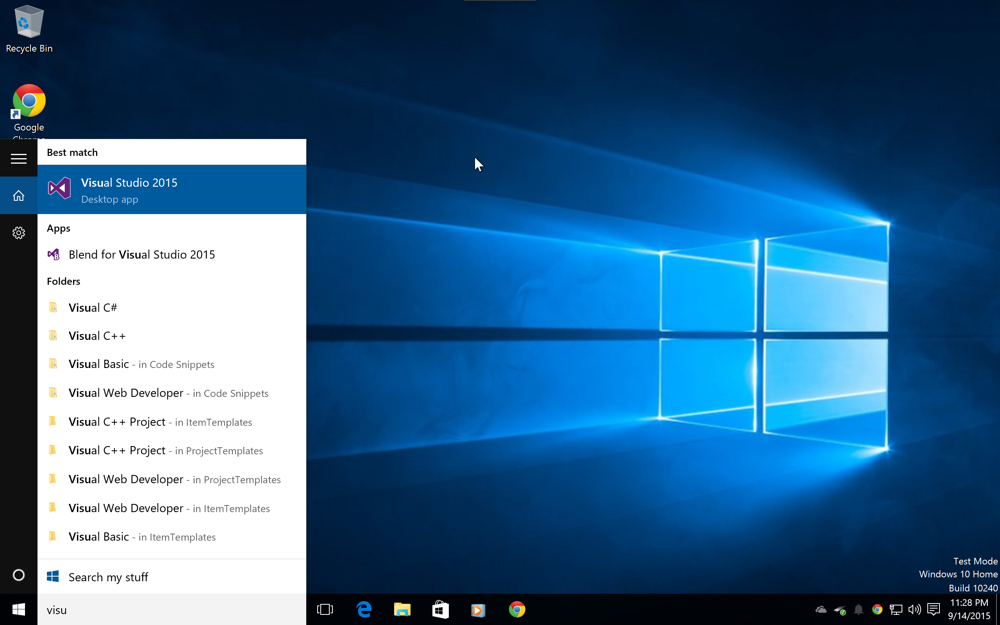
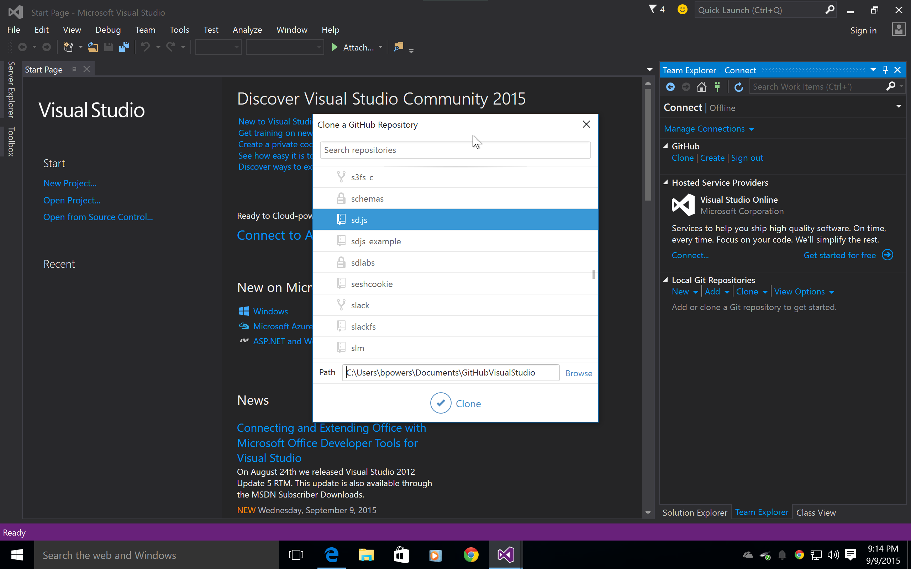
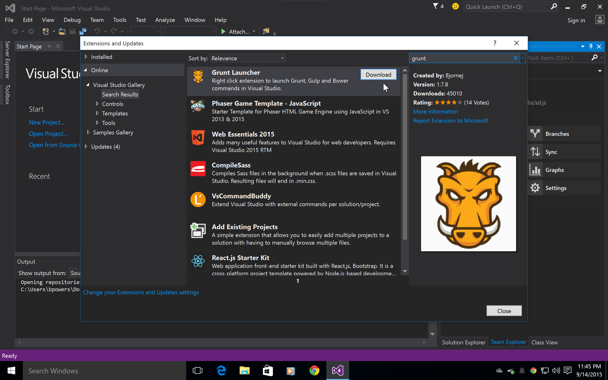
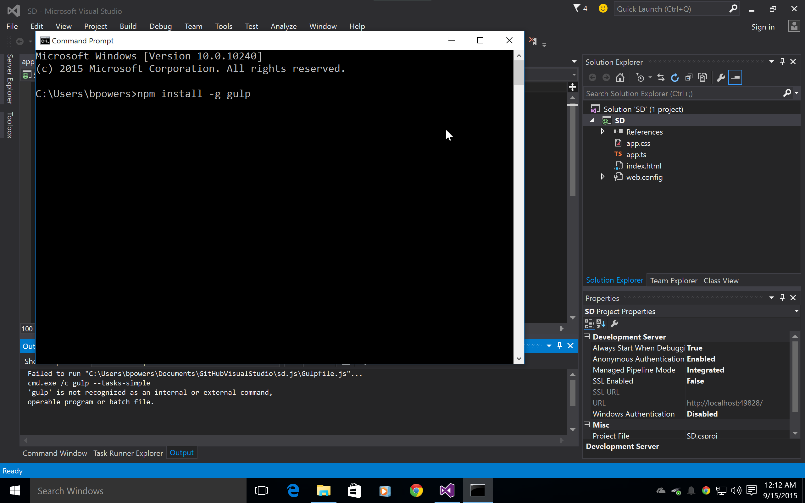
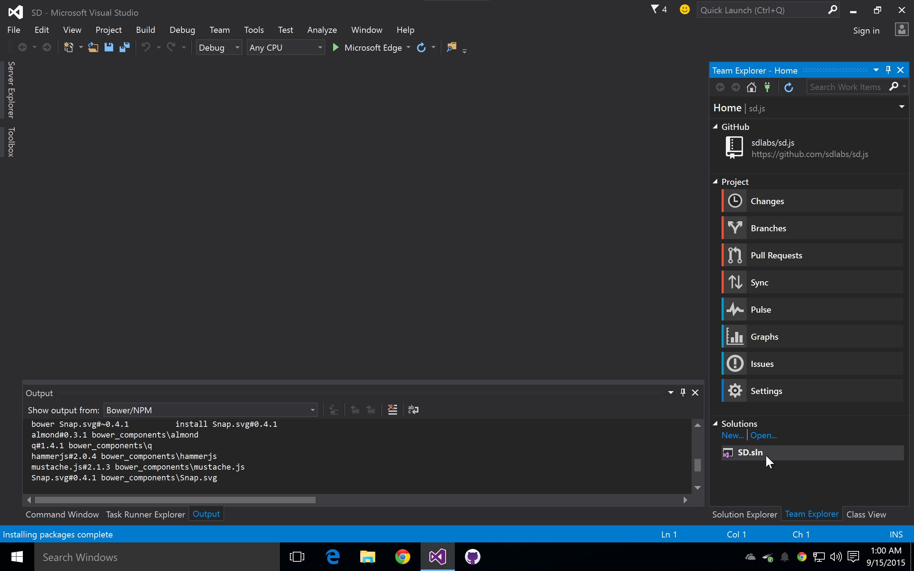
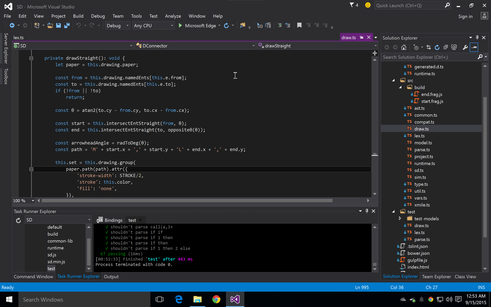

Visual Studio development
=========================

Download the free 2015 Visual Studio Community edition from here:

https://www.visualstudio.com/en-us/downloads/download-visual-studio-vs.aspx

In the installer, make sure you select `Git for Windows`, `Joyent
node.js`, and `GitHub Extensions`.

It probably makes sense from the github website to 'fork' a copy of
the repository into your personal account, which will make Pull
Requests easy.

Get to this dialog from the Tools -> Extensions and updates.

Which is the way to do builds & run unit tests

From a `cmd.exe` prompt, install gulp globally.  This is unfortunate
but necessary.

From the Team Explorer on the right, choose the `SD` solution from the
Solutions tab towards the bottom right.

Now, from the task runner explorer, choose the 'test' task from under
the Gruntfile.  This should show some output ending with '67 passing'.

After editing code, re-run unit tests (and create new tests for new
functionality.
